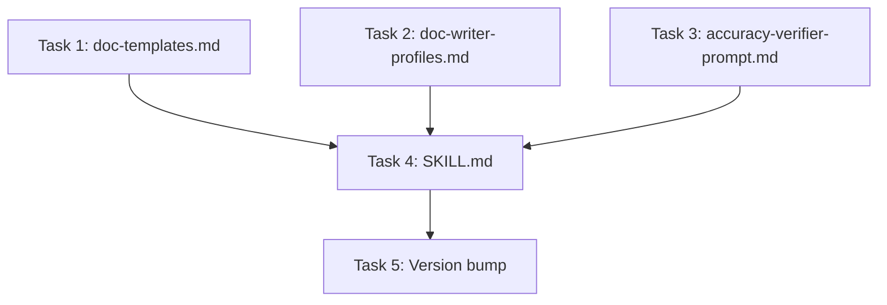

# `/build:docs` Skill Implementation Plan

> **For agentic workers:** REQUIRED: Use superpowers:subagent-driven-development (if subagents available) or superpowers:executing-plans to implement this plan. Steps use checkbox (`- [ ]`) syntax for tracking.

**Goal:** Add a `/build:docs` skill to the build plugin that automatically generates developer docs (to `docs/`) and user docs (to `public-docs/`) from pipeline artifacts and the codebase.

**Architecture:** The skill follows the same structure as the existing `/build:implement` skill — a SKILL.md orchestration file with reference files for prompts and templates. Four files total: SKILL.md, doc-writer-profiles.md (6 writer prompts), doc-templates.md (6 structural templates), and accuracy-verifier-prompt.md. Plus a version bump to plugin.json.

**Tech Stack:** Claude Code skills (Markdown-based prompt engineering), Claude Code plugin system

---

## File Structure

| File | Action | Responsibility |
|------|--------|----------------|
| `skills/docs/SKILL.md` | Create | Main orchestration logic — Phases 0-3 |
| `skills/docs/references/doc-templates.md` | Create | Structural templates for each doc type (README, user guide, config ref, API ref, architecture, contributing) |
| `skills/docs/references/doc-writer-profiles.md` | Create | Six writer prompts, one per doc type, with role/tone/source material instructions |
| `skills/docs/references/accuracy-verifier-prompt.md` | Create | Prompt for the accuracy verification agent |
| `.claude-plugin/plugin.json` | Modify | Version bump to 1.5.0, add docs skill to description |

**Note:** These are all prompt engineering files (Markdown), not executable code. There are no unit tests to write — verification is structural (files exist, reference each other correctly, follow established patterns).

---

## Chunk 1: Reference Files

### Task 1: Create doc-templates.md with structural templates for all 6 doc types

**Files:**
- Create: `skills/docs/references/doc-templates.md`

- [ ] **Step 1: Create the doc-templates.md file**

This file contains the structural template for each doc type. The doc-writer agents use these templates to produce consistently structured output. Each template uses `{placeholder}` syntax for content the agent fills in.

```markdown
# Doc Templates

Templates for each doc type generated by `/build:docs`. Doc-writer agents use these to produce consistently structured output.

---

## README Template

` ` `markdown
<!-- build:docs:auto-generated — do not edit between markers unless you remove the marker -->

# {product_name}

{one_line_description}

<!-- build:docs:start:features -->
## Features

{feature_list — bullet points from PRD, confirmed against implementation report}
<!-- build:docs:end:features -->

<!-- build:docs:start:quickstart -->
## Quick Start

### Prerequisites

{prerequisites — language runtime, tools, system dependencies}

### Installation

` ` `bash
{install_commands — from package.json, Cargo.toml, etc.}
` ` `

### Running

` ` `bash
{run_command — dev server, CLI usage, etc.}
` ` `
<!-- build:docs:end:quickstart -->

<!-- build:docs:start:usage -->
## Usage

{brief_usage_overview — 2-3 paragraphs covering the primary workflow}

For detailed usage instructions, see the [User Guide]({user_guide_url}).
<!-- build:docs:end:usage -->

<!-- build:docs:start:docs -->
## Documentation

- [User Guide]({user_guide_url}) — how to use {product_name}
- [Configuration Reference]({config_ref_url}) — configuration options
- [API Reference](docs/api-reference.md) — API endpoints and contracts
- [Architecture](docs/architecture.md) — system design and component overview
- [Contributing](docs/contributing.md) — development setup and guidelines
<!-- build:docs:end:docs -->

<!-- build:docs:start:contributing -->
## Contributing

See [CONTRIBUTING](docs/contributing.md) for development setup, testing, and guidelines.
<!-- build:docs:end:contributing -->

<!-- build:docs:start:license -->
## License

{license_info — from LICENSE file or package.json}
<!-- build:docs:end:license -->
` ` `

---

## User Guide Template

` ` `markdown
<!-- build:docs:auto-generated — do not edit between markers unless you remove the marker -->

# {product_name} — User Guide

{introductory_paragraph — what the product does and who it's for, from PRD}

## Getting Started

{getting_started — installation, first-run setup, initial configuration}

{repeat_for_each_feature:}
## {feature_name}

{feature_description — what it does, why you'd use it}

### How to use {feature_name}

{step_by_step_instructions}

{screenshot_if_available}

{end_repeat}

## Troubleshooting

{common_issues — derived from edge cases in design doc and known issues from implementation report}

## FAQ

{frequently_asked_questions — derived from PRD user stories and acceptance criteria}
` ` `

---

## Configuration Reference Template

` ` `markdown
<!-- build:docs:auto-generated — do not edit between markers unless you remove the marker -->

# {product_name} — Configuration Reference

{overview — how configuration works in this project}

## Environment Variables

| Variable | Description | Default | Required |
|----------|-------------|---------|----------|
| {var_name} | {description} | {default_value} | {yes/no} |

## Configuration File

{if_config_file_exists:}
**Location:** `{config_file_path}`

| Option | Type | Description | Default |
|--------|------|-------------|---------|
| {option_name} | {type} | {description} | {default} |
{end_if}

## CLI Flags

{if_cli_flags_exist:}
| Flag | Description | Default |
|------|-------------|---------|
| {flag} | {description} | {default} |
{end_if}
` ` `

---

## API Reference Template

` ` `markdown
<!-- build:docs:auto-generated — do not edit between markers unless you remove the marker -->

# {product_name} — API Reference

**Base URL:** `{base_url}`
**Authentication:** {auth_method}

{repeat_for_each_endpoint_group:}
## {group_name}

{group_description}

### `{METHOD} {path}`

{endpoint_description}

**Parameters:**

| Name | In | Type | Required | Description |
|------|-----|------|----------|-------------|
| {name} | {path/query/body} | {type} | {yes/no} | {description} |

**Response:**

` ` `json
{response_example}
` ` `

**Errors:**

| Status | Code | Description |
|--------|------|-------------|
| {status} | {code} | {description} |

{end_repeat}
` ` `

---

## Architecture Overview Template

` ` `markdown
<!-- build:docs:auto-generated — do not edit between markers unless you remove the marker -->

# {product_name} — Architecture Overview

## System Overview

{high_level_description — what the system does and how it's structured}

## Architecture Diagram

` ` `mermaid
{architecture_diagram — from design doc Section 3.2, updated to reflect what was actually built}
` ` `

## Key Components

| Component | Responsibility | Key Files |
|-----------|---------------|-----------|
| {component_name} | {what_it_does} | {file_paths} |

## Data Flow

{data_flow_description — how data moves through the system}

` ` `mermaid
{sequence_diagram — from design doc Section 6, for the primary flow}
` ` `

## Technology Stack

| Layer | Technology | Purpose |
|-------|-----------|---------|
| {layer} | {technology} | {purpose} |

## Key Design Decisions

| Decision | Rationale |
|----------|-----------|
| {decision} | {why — from design doc Section 10} |
` ` `

---

## Contributing Guide Template

` ` `markdown
<!-- build:docs:auto-generated — do not edit between markers unless you remove the marker -->

# Contributing to {product_name}

## Development Setup

### Prerequisites

{prerequisites — language, tools, system dependencies}

### Getting Started

` ` `bash
{clone_and_setup_commands}
` ` `

### Running Locally

` ` `bash
{dev_server_command}
` ` `

## Testing

` ` `bash
# Run all tests
{test_command}

# Run specific test file
{test_single_command}

# Run with coverage
{coverage_command}
` ` `

## Code Style

{linter_and_formatter — what tools are used, how to run them}

` ` `bash
# Lint
{lint_command}

# Format
{format_command}
` ` `

## Project Structure

` ` `
{directory_tree — top-level structure with descriptions}
` ` `

## Making Changes

1. Create a feature branch: `git checkout -b feature/your-feature`
2. Make your changes
3. Run tests: `{test_command}`
4. Run linting: `{lint_command}`
5. Commit with a descriptive message
6. Push and open a pull request
` ` `
```

Note: The ` ` ` (with spaces) are placeholders for triple backticks. In the actual file, use proper triple backticks. Nest using different fence lengths (4 backticks for outer, 3 for inner) where needed.

- [ ] **Step 2: Verify the file structure**

Read the file and confirm it has exactly 6 template sections: README, User Guide, Configuration Reference, API Reference, Architecture Overview, Contributing Guide.

- [ ] **Step 3: Commit**

```bash
git add skills/docs/references/doc-templates.md
git commit -m "feat(docs): add structural templates for all 6 doc types

README with merge markers, user guide, config reference, API reference,
architecture overview, and contributing guide templates. All templates
include auto-generated markers for re-run idempotency."
```

---

### Task 2: Create doc-writer-profiles.md with 6 writer prompts

**Files:**
- Create: `skills/docs/references/doc-writer-profiles.md`

- [ ] **Step 1: Create the doc-writer-profiles.md file**

This file contains one named section per doc type. The orchestrator reads it, finds the section matching the doc type, and uses that prompt for the agent. Each prompt specifies role, tone, source material, and references the template in `doc-templates.md`.

```markdown
# Doc Writer Profiles

The orchestrator selects a writer profile based on the doc type being generated. Each writer receives the profile prompt below, plus the relevant source material and codebase context injected by the orchestrator.

## Profile Selection

| Doc Type | Section | Tone | Primary Sources |
|----------|---------|------|-----------------|
| README.md | `README Writer` | Balanced — approachable but precise | PRD, codebase (package manager, scripts) |
| User Guide | `User Guide Writer` | Approachable, task-oriented | PRD (features, user stories), implementation report |
| Configuration Reference | `Config Reference Writer` | Reference-style, concise | Codebase (config files, .env.example, CLI flags) |
| API Reference | `API Reference Writer` | Precise, technical | Design doc (Section 5), actual route/controller code |
| Architecture Overview | `Architecture Writer` | Technical, explanatory | Design doc (Sections 2-3, 6, 10), implementation report |
| Contributing Guide | `Contributing Guide Writer` | Welcoming, practical | Codebase (package manager, test config, lint config, project structure) |

---

## README Writer

` ` `
You are a technical writer generating a README.md for a software project.

Product: <product_name>
Output path: README.md

Your tone: Balanced — approachable enough for new users, precise enough for developers. The README is the first thing anyone sees.

Source material provided:
- PRD: product vision, features, target users
- Codebase context: package manager, install commands, run commands, license

Template: Read `references/doc-templates.md`, section "README Template". Follow its structure exactly, replacing all {placeholders} with actual content.

Instructions:
1. Read the PRD to understand what the product does and who it's for.
2. Read the codebase context to get accurate install/run commands.
3. Write the README following the template structure.
4. Wrap each generated section in the <!-- build:docs:start/end --> markers shown in the template. These markers enable re-run idempotency.
5. If the implementation report mentions features that were skipped or not yet built, do NOT include them in the features list. Only document what actually exists.
6. Save to README.md.

Do NOT invent features, commands, or dependencies. If you're unsure about something, mark it with [VERIFY] so the accuracy verifier catches it.
` ` `

---

## User Guide Writer

` ` `
You are a technical writer generating a user guide for end users.

Product: <product_name>
Output path: public-docs/guide.md

Your tone: Approachable and task-oriented. Write for someone who wants to USE the product, not understand how it's built. Lead with what users can DO, not how the system works internally.

Source material provided:
- PRD: features, user stories, acceptance criteria, target users
- Implementation report: what was actually built, any skipped features
- Codebase context: any user-facing CLI commands, configuration options

Template: Read `references/doc-templates.md`, section "User Guide Template". Follow its structure.

Instructions:
1. Read the PRD to understand features and user stories.
2. Check the implementation report to confirm which features were actually shipped.
3. For each shipped feature, write a section with:
   - What it does (one paragraph)
   - How to use it (step-by-step instructions)
   - Any configuration needed
4. Only document features that were actually implemented. Do NOT document planned but unbuilt features.
5. Include a Getting Started section that walks through first-time setup.
6. Include a Troubleshooting section with common issues (derive from edge cases in the design doc and issues filed in the implementation report).
7. Create the public-docs/ directory if it doesn't exist.
8. Save to public-docs/guide.md.

Do NOT write developer documentation. No architecture, no API details, no code internals. This is for end users.
` ` `

---

## Config Reference Writer

` ` `
You are a technical writer generating a configuration reference.

Product: <product_name>
Output path: public-docs/configuration.md

Your tone: Reference-style — concise, scannable, no narrative fluff. Users come here to look up a specific option, not to read a story.

Source material provided:
- Codebase context: .env.example, config files, CLI flag definitions, default values

Template: Read `references/doc-templates.md`, section "Configuration Reference Template". Follow its structure.

Instructions:
1. Read all config-related files provided in the codebase context.
2. For environment variables: extract name, description (from comments), default value, and whether it's required.
3. For config files: extract each option with its type, description, and default.
4. For CLI flags: extract each flag with its description and default.
5. Group options logically (by feature area or config file section).
6. Save to public-docs/configuration.md.

Do NOT document internal-only config options that users never need to touch. Focus on user-facing configuration.
Do NOT invent options. Only document what exists in the codebase.
` ` `

---

## API Reference Writer

` ` `
You are a technical writer generating an API reference for developers.

Product: <product_name>
Output path: docs/api-reference.md

Your tone: Precise and technical. Developers reading this need exact method signatures, parameter types, and response shapes. No hand-waving.

Source material provided:
- Design doc Section 5: API design with endpoints, request/response shapes, error responses
- Codebase context: actual route/controller files showing implemented endpoints

Template: Read `references/doc-templates.md`, section "API Reference Template". Follow its structure.

Instructions:
1. Read the design doc API section for the intended contract.
2. Read the actual route/controller code to confirm what was implemented.
3. If the code differs from the design doc, document WHAT THE CODE ACTUALLY DOES, not what the design doc says. The code is the source of truth.
4. For each endpoint, document: method, path, description, parameters (with types), response shape (with example), and error responses.
5. Group endpoints logically (by resource or feature area).
6. Include authentication requirements for each endpoint.
7. Save to docs/api-reference.md.

Do NOT document endpoints that exist in the design doc but were not implemented. Only document working endpoints.
` ` `

---

## Architecture Writer

` ` `
You are a technical writer generating an architecture overview for developers.

Product: <product_name>
Output path: docs/architecture.md

Your tone: Technical and explanatory. Help a new developer understand how the system is structured and why key decisions were made.

Source material provided:
- Design doc: Sections 2 (tech stack), 3 (system context, architecture diagram, key components), 6 (key sequences), 10 (alternatives and trade-offs)
- Implementation report: what was actually built, any deviations from the design
- Codebase context: actual project structure, key files

Template: Read `references/doc-templates.md`, section "Architecture Overview Template". Follow its structure.

Instructions:
1. Read the design doc for the intended architecture.
2. Cross-reference with the implementation report and actual codebase to identify any deviations.
3. Document THE ACTUAL ARCHITECTURE, not the planned one. If the implementation diverged from the design, document what was built.
4. Include Mermaid diagrams from the design doc, updated to reflect reality.
5. List key components with their responsibilities and the actual files that implement them.
6. Include key design decisions and their rationale (from design doc Section 10).
7. Save to docs/architecture.md.

Do NOT copy the design doc verbatim. Distill it into a concise architecture overview that a new developer can read in 10 minutes.
` ` `

---

## Contributing Guide Writer

` ` `
You are a technical writer generating a contributing guide for developers.

Product: <product_name>
Output path: docs/contributing.md

Your tone: Welcoming and practical. Make it easy for a new contributor to get set up and start working.

Source material provided:
- Codebase context: package manager, scripts (test, lint, format, build), project structure, CI config

Template: Read `references/doc-templates.md`, section "Contributing Guide Template". Follow its structure.

Instructions:
1. Read the codebase context to understand the development toolchain.
2. Document the exact commands for: installing dependencies, running locally, running tests, running linting, running formatting.
3. Only document commands that actually exist in the project. Do NOT invent npm scripts or make targets.
4. Include the project directory structure with brief descriptions of each top-level directory.
5. If the project has no tests, note this: "Tests have not been set up for this project yet."
6. If the project has CI, briefly describe what it checks.
7. Save to docs/contributing.md.

Do NOT include architecture or API information. That belongs in the architecture overview and API reference respectively.
` ` `
```

- [ ] **Step 2: Verify the file has all 6 profiles**

Search the file for `## ` headings. Should find: README Writer, User Guide Writer, Config Reference Writer, API Reference Writer, Architecture Writer, Contributing Guide Writer.

- [ ] **Step 3: Commit**

```bash
git add skills/docs/references/doc-writer-profiles.md
git commit -m "feat(docs): add doc writer profile prompts for all 6 doc types

Each profile specifies role, tone, source material, and instructions.
Writers prioritize code as source of truth over design doc when they
diverge. All profiles reference templates in doc-templates.md."
```

---

### Task 3: Create accuracy-verifier-prompt.md

**Files:**
- Create: `skills/docs/references/accuracy-verifier-prompt.md`

- [ ] **Step 1: Create the accuracy-verifier-prompt.md file**

```markdown
# Accuracy Verifier Prompt

The orchestrator dispatches this agent after all doc writers complete. It cross-checks every factual claim in the generated docs against the actual codebase.

---

## Prompt

` ` `
You are a documentation accuracy verifier. Your job is to cross-check generated documentation against the actual codebase to find factual errors. You did NOT write these docs — your job is to independently verify them.

Generated doc files to verify:
<list of generated doc file paths>

Instructions:
1. Read each generated doc file.
2. For every factual claim, verify it against the codebase:

   **File paths:** For every file path mentioned in the docs, check that the file actually exists.

   **Commands:** For every command (install, test, build, run, lint), check that:
   - The command exists in package.json scripts, Makefile, or equivalent
   - The command syntax is correct

   **API signatures:** For every API endpoint documented:
   - Check that the route exists in the codebase
   - Check that the HTTP method matches
   - Check that documented parameters match the actual handler's parameter list
   - Check that the response shape matches (at least structurally)

   **Import paths and module names:** Check that any import paths or module names mentioned in docs are valid.

   **Config options:** For every config option documented:
   - Check that the option name matches what the code actually reads
   - Check that the default value matches what the code sets

   **Version numbers:** Check that dependency names and versions match package.json, Cargo.toml, or equivalent.

   **Code examples:** For any inline code examples, verify they use correct syntax and reference real functions/classes/types from the codebase.

3. For each issue found, report:
   - **File:** which doc file
   - **Section:** which section or heading
   - **Claim:** what the doc says
   - **Reality:** what the code actually shows
   - **Fix:** the corrected text

Report your findings:
- PASS: All factual claims verified. State how many claims you checked.
- FAIL: List each issue found with the fields above.

Do NOT fix any issues. Only report them. The orchestrator will apply fixes.
Do NOT evaluate writing quality, tone, or completeness. Only verify factual accuracy.
` ` `
```

- [ ] **Step 2: Commit**

```bash
git add skills/docs/references/accuracy-verifier-prompt.md
git commit -m "feat(docs): add accuracy verifier prompt

Cross-checks file paths, commands, API signatures, config options,
version numbers, and code examples in generated docs against the
actual codebase. Reports issues for the orchestrator to fix."
```

---

## Chunk 2: SKILL.md and Version Bump

### Task 4: Create SKILL.md with full orchestration logic

**Files:**
- Create: `skills/docs/SKILL.md`

- [ ] **Step 1: Create the SKILL.md file**

This is the main orchestration file. It implements Phases 0-3 from the spec. It references the three files created in Tasks 1-3.

Write the complete SKILL.md with:
- YAML frontmatter (name: docs, description, disable-model-invocation: true)
- Phase 0: Discovery & Doc Plan (artifact location, codebase scan, detection logic, existing docs check, doc plan presentation)
- Phase 1: Generation (parallel agent dispatch, profile selection from doc-writer-profiles.md, agent failure handling, GitHub Pages workflow generation, public-docs/index.md and _config.yml generation)
- Phase 2: Verification (accuracy verifier from accuracy-verifier-prompt.md, visual capture with browser tools warning, dev server error handling)
- Phase 3: Review & Commit (summary presentation, user review gate, commit)
- Conversation Style section

The full content is specified in the design spec at `docs/superpowers/specs/2026-03-14-docs-skill-design.md`. Translate the spec's process description into SKILL.md prompt instructions, following the same style and structure as `skills/implement/SKILL.md`.

Key patterns to follow from the implement skill:
- Use `Agent()` dispatch syntax with `model` and `run_in_background` parameters
- Reference files with `references/` relative paths
- Use code blocks for example output (doc plan, summary)
- Include explicit error handling for each phase

- [ ] **Step 2: Verify SKILL.md references all three reference files**

Search the file for:
- `references/doc-templates.md` — should appear in Phase 1
- `references/doc-writer-profiles.md` — should appear in Phase 1
- `references/accuracy-verifier-prompt.md` — should appear in Phase 2

- [ ] **Step 3: Verify phase flow is complete**

Read the file and confirm all 4 phases are present:
- Phase 0: Discovery & Doc Plan
- Phase 1: Generation
- Phase 2: Verification
- Phase 3: Review & Commit

- [ ] **Step 4: Commit**

```bash
git add skills/docs/SKILL.md
git commit -m "feat(docs): add SKILL.md orchestration for /build:docs

Four-phase automated doc generation: discovery & planning, parallel
agent dispatch for 6 doc types, accuracy verification against codebase,
optional visual capture with browser tools warning, and user review
gate before commit. Generates developer docs to docs/ and user docs
to public-docs/ for GitHub Pages."
```

---

### Task 5: Bump plugin version to 1.5.0

**Files:**
- Modify: `.claude-plugin/plugin.json`

- [ ] **Step 1: Update version and description**

Change version from `1.4.0` to `1.5.0`. Add docs skill to the description.

```json
{
  "name": "build",
  "version": "1.5.0",
  "description": "Claude Code plugin for the full software development lifecycle. Includes interactive PRD builder (/build:prd), technical design document builder (/build:design), implementation planner (/build:plan), implementation executor (/build:implement) with TDD dispatch and multi-lens verification, and documentation generator (/build:docs) that produces developer docs and user docs with accuracy verification and optional visual capture."
}
```

- [ ] **Step 2: Commit**

```bash
git add .claude-plugin/plugin.json
git commit -m "chore: bump to v1.5.0 — add /build:docs skill

Automated documentation generator that closes the pipeline loop.
Produces developer docs (API ref, architecture, contributing) and
user docs (user guide, config ref) with accuracy verification."
```

---

## Task Dependency Graph



**Parallelizable:** Tasks 1, 2, and 3 can all run simultaneously (no file overlap).

**Critical path:** T1/T2/T3 (parallel) → T4 → T5

---

## Summary

| Metric | Value |
|--------|-------|
| Total tasks | 5 |
| Parallelizable | T1 + T2 + T3 |
| Files created | 4 (SKILL.md, doc-templates.md, doc-writer-profiles.md, accuracy-verifier-prompt.md) |
| Files modified | 1 (plugin.json) |
| Estimated complexity | T1: S, T2: M, T3: S, T4: M, T5: S |
