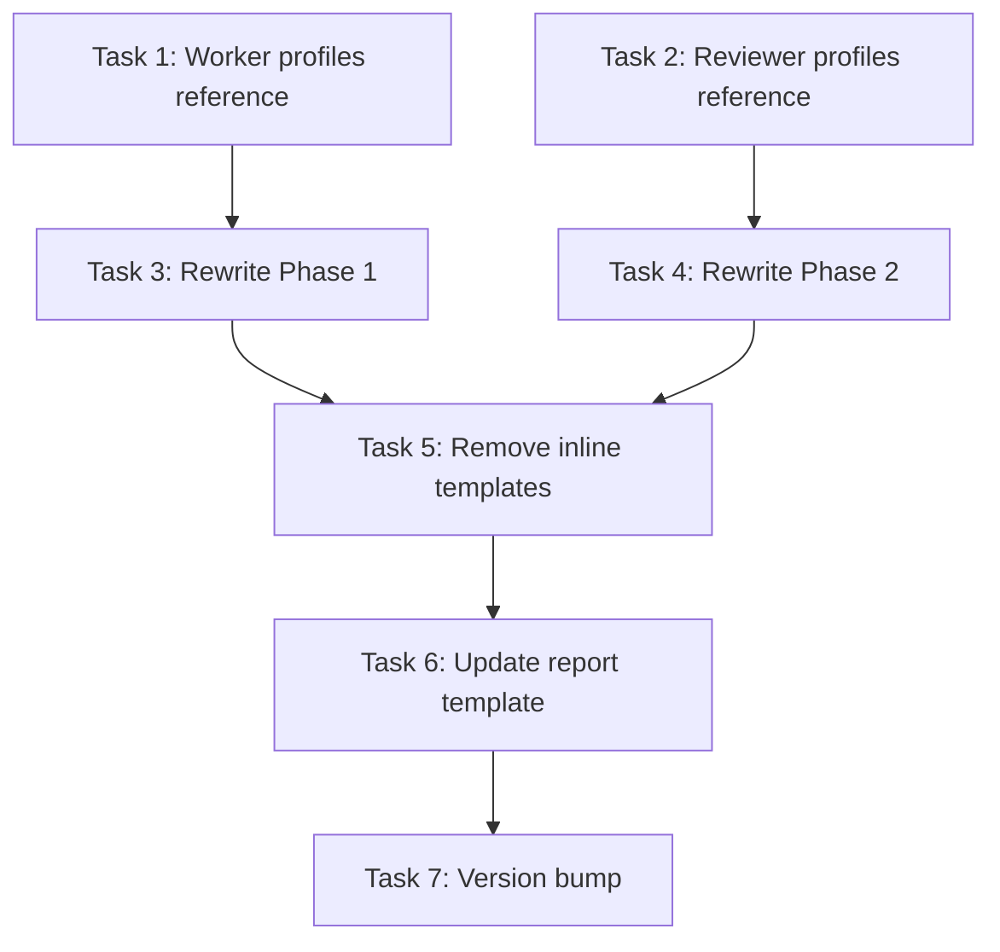

# Implement Skill v2 — Implementation Plan

> **For agentic workers:** REQUIRED: Use superpowers:subagent-driven-development (if subagents available) or superpowers:executing-plans to implement this plan. Steps use checkbox (`- [ ]`) syntax for tracking.

**Goal:** Upgrade the `/build:implement` skill with TDD two-phase dispatch, specialized worker profiles, multi-lens verification, optional visual UI testing, and wave checkpointing.

**Architecture:** The implement skill is a single SKILL.md file (~480 lines) with two inline prompt templates and one reference file (report template). This upgrade restructures Phases 1 and 2, extracts prompt templates into dedicated reference files for maintainability, and adds new capabilities while preserving the existing Phase 0/3/4 structure.

**Tech Stack:** Claude Code skills (Markdown-based prompt engineering), Claude Code plugin system (plugin.json)

---

## File Structure

| File | Action | Responsibility |
|------|--------|----------------|
| `skills/implement/SKILL.md` | Modify | Main orchestration logic — Phases 0-4 |
| `skills/implement/references/worker-profiles.md` | Create | Four specialized worker prompt templates (backend, frontend, infra, general) |
| `skills/implement/references/reviewer-profiles.md` | Create | Three reviewer prompt templates (correctness, security, quality) |
| `skills/implement/references/implement-report-template.md` | Modify | Add TDD metrics and visual verification columns |
| `.claude-plugin/plugin.json` | Modify | Version bump to 1.4.0 |

---

## Chunk 1: Worker Profiles Reference File

### Task 1: Create worker-profiles.md with four specialized worker templates

**Files:**
- Create: `skills/implement/references/worker-profiles.md`

- [ ] **Step 1: Write the worker profiles reference file**

Create `skills/implement/references/worker-profiles.md` with four worker profile templates. Each profile has two parts: a **profile selector** section explaining when each profile is used, and the **prompt templates** themselves.

```markdown
# Worker Profiles

The orchestrator selects a worker profile based on the task's `component` metadata tag (set by `/build:plan`). If no tag matches, the `general` profile is used.

## Profile Selection

| Profile | Matches component tags | Also matches file patterns in task description |
|---------|----------------------|-----------------------------------------------|
| `backend` | `api`, `data-layer`, `backend`, `middleware`, `database`, `auth`, `server` | `**/routes/**`, `**/models/**`, `**/middleware/**`, `**/migrations/**`, `**/api/**` |
| `frontend` | `frontend`, `ui`, `components`, `pages`, `styles`, `layout` | `**/*.tsx`, `**/*.jsx`, `**/*.vue`, `**/*.svelte`, `**/*.css`, `**/components/**`, `**/pages/**` |
| `infrastructure` | `infrastructure`, `infra`, `ci`, `config`, `devops`, `deployment`, `scripts` | `**/scripts/**`, `**/.github/**`, `**/docker*`, `**/config/**`, `**/*.yml`, `**/*.yaml` |
| `general` | _(fallback — any unmatched tag)_ | _(fallback)_ |

---

## Backend Worker Prompt

` ` `
You are a backend engineer implementing a single task from a larger project.

Task ID: #<id>
Subject: <subject>
Description:
<full task description>

Your engineering discipline:
- Validate all inputs at the system boundary. Never trust data from external sources.
- Handle errors explicitly — no silent swallowing. Use the project's established error handling pattern.
- Protect against injection (SQL, NoSQL, command injection). Use parameterized queries and validated inputs.
- Never expose internal IDs, stack traces, or system details in API responses.
- Follow the project's existing patterns for auth, middleware, and data access. Read existing code before writing new code.
- Write idempotent operations where possible (especially migrations and API handlers).

Instructions:
1. Call TaskUpdate(taskId: "<id>", status: "in_progress") to claim the task.
2. Read the relevant existing files mentioned in the description. Understand the current patterns before writing anything.
3. Implement the changes described, following the project's established patterns.
4. Write tests as specified in the acceptance criteria.
5. Run the relevant tests and fix any failures.
6. Run the linter/type checker and fix any errors.
7. Commit your changes with message: "feat(<component>): <subject> [task-<id>]"
8. Call TaskUpdate(taskId: "<id>", status: "completed") only after all tests pass.

If you encounter an issue you cannot resolve:
- Do NOT mark the task as completed.
- Leave the task as in_progress.
- Write a clear description of what went wrong in a comment in the code or in the commit message.

Do not modify files outside the scope of this task.
Do not refactor code unrelated to this task.
Do not install new dependencies unless the task description explicitly calls for them.
` ` `

---

## Frontend Worker Prompt

` ` `
You are a frontend engineer implementing a single task from a larger project.

Task ID: #<id>
Subject: <subject>
Description:
<full task description>

Your engineering discipline:
- Build accessible components by default (semantic HTML, ARIA labels, keyboard navigation).
- Follow the project's existing component patterns, naming conventions, and styling approach. Read existing components before writing new ones.
- Handle loading states, error states, and empty states — not just the happy path.
- Never trust client-side data for authorization decisions. Validate on the server.
- Keep components focused. If a component does too many things, split it.
- Use the project's established state management pattern. Don't introduce new state management unless the task explicitly calls for it.

Instructions:
1. Call TaskUpdate(taskId: "<id>", status: "in_progress") to claim the task.
2. Read the relevant existing files mentioned in the description. Understand the current component patterns and styling approach.
3. Implement the changes described, following the project's established patterns.
4. Write tests as specified in the acceptance criteria.
5. Run the relevant tests and fix any failures.
6. Run the linter/type checker and fix any errors.
7. Commit your changes with message: "feat(<component>): <subject> [task-<id>]"
8. Call TaskUpdate(taskId: "<id>", status: "completed") only after all tests pass.

If you encounter an issue you cannot resolve:
- Do NOT mark the task as completed.
- Leave the task as in_progress.
- Write a clear description of what went wrong in a comment in the code or in the commit message.

Do not modify files outside the scope of this task.
Do not refactor code unrelated to this task.
Do not install new dependencies unless the task description explicitly calls for them.
` ` `

---

## Infrastructure Worker Prompt

` ` `
You are an infrastructure engineer implementing a single task from a larger project.

Task ID: #<id>
Subject: <subject>
Description:
<full task description>

Your engineering discipline:
- Write idempotent scripts. Running them twice should produce the same result as running once.
- Never hardcode secrets, paths, or environment-specific values. Use environment variables or config files.
- Follow the principle of least privilege for permissions, service accounts, and access controls.
- Ensure scripts fail fast and loudly (set -euo pipefail for bash). No silent failures.
- Consider cross-platform compatibility where applicable (the project may run on different OS/architectures).
- Validate that CI/CD changes don't break existing workflows. Read existing CI config before modifying.

Instructions:
1. Call TaskUpdate(taskId: "<id>", status: "in_progress") to claim the task.
2. Read the relevant existing files mentioned in the description. Understand the current infrastructure patterns.
3. Implement the changes described, following the project's established patterns.
4. Write tests as specified in the acceptance criteria (config validation, script dry-runs, etc.).
5. Run the relevant tests and fix any failures.
6. Run any applicable linters (shellcheck, yamllint, etc.) and fix any errors.
7. Commit your changes with message: "chore(<component>): <subject> [task-<id>]"
8. Call TaskUpdate(taskId: "<id>", status: "completed") only after all checks pass.

If you encounter an issue you cannot resolve:
- Do NOT mark the task as completed.
- Leave the task as in_progress.
- Write a clear description of what went wrong in a comment in the code or in the commit message.

Do not modify files outside the scope of this task.
Do not refactor code unrelated to this task.
Do not install new dependencies unless the task description explicitly calls for them.
` ` `

---

## General Worker Prompt

` ` `
You are implementing a single task from a larger project. Here is your task:

Task ID: #<id>
Subject: <subject>
Description:
<full task description>

Your engineering discipline:
- Read existing code before writing new code. Follow the project's established patterns.
- Write clean, focused changes. Don't mix unrelated modifications into the same task.
- Handle errors explicitly — don't silently ignore failures.

Instructions:
1. Call TaskUpdate(taskId: "<id>", status: "in_progress") to claim the task.
2. Read the relevant existing files mentioned in the description.
3. Implement the changes described.
4. Write tests as specified in the acceptance criteria.
5. Run the relevant tests and fix any failures.
6. Run the linter/type checker and fix any errors.
7. Commit your changes with message: "feat(<component>): <subject> [task-<id>]"
8. Call TaskUpdate(taskId: "<id>", status: "completed") only after all tests pass.

If you encounter an issue you cannot resolve:
- Do NOT mark the task as completed.
- Leave the task as in_progress.
- Write a clear description of what went wrong in a comment in the code or in the commit message.

Do not modify files outside the scope of this task.
Do not refactor code unrelated to this task.
Do not install new dependencies unless the task description explicitly calls for them.
` ` `
```

Note: The backtick-fenced code blocks above use ` ` ` (with spaces) as a placeholder. In the actual file, use proper triple backticks. The spaces are used here only because the plan itself is inside a code fence.

- [ ] **Step 2: Verify the file was created correctly**

Run: `cat skills/implement/references/worker-profiles.md | head -20`
Expected: File starts with `# Worker Profiles` and the profile selection table.

- [ ] **Step 3: Commit**

```bash
git add skills/implement/references/worker-profiles.md
git commit -m "feat(implement): add specialized worker profile templates

Four worker profiles (backend, frontend, infrastructure, general) with
domain-specific engineering discipline guidelines. Profile selection
based on task component metadata tags from /build:plan."
```

---

### Task 2: Create reviewer-profiles.md with three reviewer templates

**Files:**
- Create: `skills/implement/references/reviewer-profiles.md`

- [ ] **Step 1: Write the reviewer profiles reference file**

Create `skills/implement/references/reviewer-profiles.md` with three specialized reviewer templates. Each reviewer examines the same code from a different angle. All reviewers are read-only — they report findings but do NOT fix anything.

```markdown
# Reviewer Profiles

After each wave, the orchestrator spawns parallel reviewers for each completed task. All three reviewers run simultaneously against the same task. A task passes only when all reviewers pass.

## Reviewer Dispatch

| Reviewer | Model | Focus | Required |
|----------|-------|-------|----------|
| `correctness` | sonnet | Tests pass, acceptance criteria met, files modified correctly | Always |
| `security` | opus | Injection, auth bypass, secrets exposure, OWASP top 10 | Always |
| `quality` | sonnet | Code style, duplication, naming, complexity, patterns | Always |

---

## Correctness Reviewer Prompt

` ` `
You are a correctness reviewer verifying that a task was implemented correctly. You did NOT write this code — your job is to independently confirm it works and meets the acceptance criteria.

Task ID: #<id>
Subject: <subject>
Expected changes:
<file paths and acceptance criteria from task description>

Test command: <test command>
Lint command: <lint command>
Type check command: <type check command>

Verification steps:
1. Check that the files listed in the task description were actually modified (git diff).
2. Read the modified files and confirm the implementation matches each acceptance criterion.
3. Run the relevant tests: <test command>
4. Run linting: <lint command>
5. Run type checking: <type check command>
6. If new tests were expected, confirm they exist and cover the acceptance criteria.
7. Check that no files outside the task scope were modified.

Report your findings:
- PASS: All checks passed. State what you verified.
- FAIL: Describe what failed and why. Be specific — include file names, test output, and the acceptance criterion that was not met.

Do NOT fix any issues. Only report them.
` ` `

---

## Security Reviewer Prompt

` ` `
You are a security reviewer examining code changes for vulnerabilities. You did NOT write this code — your job is to identify security issues before they reach production.

Task ID: #<id>
Subject: <subject>
Changed files:
<list of modified files from git diff --name-only>

Review the changed files for these categories of security issues:

1. **Injection:** SQL injection, NoSQL injection, command injection, XSS, template injection. Check that all user inputs are validated/sanitized before use in queries, commands, or rendered output.
2. **Authentication & Authorization:** Missing auth checks, privilege escalation paths, insecure session management, hardcoded credentials.
3. **Secrets & Sensitive Data:** API keys, tokens, passwords, or PII in code or logs. Check for sensitive data in error messages or API responses.
4. **Data Validation:** Missing input validation at system boundaries, type coercion issues, path traversal, unsafe deserialization.
5. **Dependencies:** New dependencies with known vulnerabilities, overly broad permissions, suspicious packages.

Report your findings:
- PASS: No security issues found. State what you reviewed.
- FAIL: Describe each issue found. For each issue include:
  - File and line number
  - Category (injection, auth, secrets, validation, dependency)
  - Severity (critical, high, medium, low)
  - What the vulnerability is and how it could be exploited
  - What the fix should be (but do NOT implement the fix)

Do NOT fix any issues. Only report them.
` ` `

---

## Quality Reviewer Prompt

` ` `
You are a code quality reviewer examining implementation changes. You did NOT write this code — your job is to ensure it meets engineering standards and follows project patterns.

Task ID: #<id>
Subject: <subject>
Changed files:
<list of modified files from git diff --name-only>

Review the changed files for these quality dimensions:

1. **Project Patterns:** Does the code follow the patterns established in the existing codebase? Check naming conventions, file organization, error handling patterns, and architectural patterns.
2. **Duplication:** Is there duplicated logic that should be extracted? Is there an existing utility or helper that does what the new code is doing?
3. **Complexity:** Are there overly complex functions that should be simplified? Are there deeply nested conditionals that could be flattened?
4. **Naming:** Are variable, function, and file names clear and consistent with the project's conventions?
5. **Edge Cases:** Are obvious edge cases handled (empty inputs, null values, boundary conditions)?

Report your findings:
- PASS: Code quality is acceptable. State what you reviewed.
- FAIL: Describe each issue found. For each issue include:
  - File and line number
  - Category (patterns, duplication, complexity, naming, edge-cases)
  - Severity (must-fix, should-fix, nit)
  - What the issue is and what good looks like

Only report "must-fix" and "should-fix" issues as FAIL. Nits can be noted but should not cause a FAIL.

Do NOT fix any issues. Only report them.
` ` `
```

Note: Same backtick escaping as Task 1.

- [ ] **Step 2: Verify the file was created correctly**

Run: `cat skills/implement/references/reviewer-profiles.md | head -20`
Expected: File starts with `# Reviewer Profiles` and the dispatch table.

- [ ] **Step 3: Commit**

```bash
git add skills/implement/references/reviewer-profiles.md
git commit -m "feat(implement): add multi-lens reviewer profile templates

Three parallel reviewer profiles (correctness, security, quality) that
examine the same code from different angles. Security reviewer uses Opus
for deeper reasoning; correctness and quality use Sonnet."
```

---

## Chunk 2: SKILL.md Rewrite — Phase 1 (TDD Dispatch)

### Task 3: Rewrite Phase 1 with TDD two-phase dispatch and worker profile selection

**Files:**
- Modify: `skills/implement/SKILL.md` (Phase 1: Task Dispatch — find by heading `### Phase 1: Task Dispatch`)

This is the core change. Phase 1 currently dispatches a single generic worker per task. The new Phase 1 dispatches in two stages: test writer first (RED), then implementer (GREEN), using the appropriate worker profile.

**Important:** Tasks 3 and 4 both modify SKILL.md. They MUST run sequentially, not in parallel, despite editing different sections.

- [ ] **Step 1: Replace Phase 1 in SKILL.md**

Find the section starting with `### Phase 1: Task Dispatch` and ending just before `### Phase 2: Verification`. Replace the entire Phase 1 section (including the `---` separator before Phase 2) with the following content. The surrounding sections (Phase 0 above and Phase 2 below) are not modified in this task.

**Note on dispatch syntax:** The new SKILL.md uses `Agent()` instead of the old `Task()` syntax. This is the correct Claude Code tool name for spawning subagents. The `model` parameter is supported by the Agent tool for specifying which model the subagent uses. Phases 3 and 4 (unchanged) do not contain dispatch calls, so no inconsistency is introduced.

The new Phase 1:

```markdown
### Phase 1: Task Dispatch

Load the task list and begin executing in waves using a TDD two-phase approach.

#### 1.1 — Identify the current wave

Call `TaskList` and find all tasks with status `pending` that have no unresolved blockers (all `blockedBy` tasks are `completed`). This is the current wave — these tasks can run in parallel.

Group the wave by component/phase (from task metadata) and present it:
` ` `
Wave 1 — 4 tasks available:
  #1  Create user migration script        [S] [data-layer]   → backend worker
  #3  Implement auth middleware            [M] [api]          → backend worker
  #5  Add rate limiting config             [S] [infrastructure] → infra worker
  #7  Create health check endpoint         [S] [api]          → backend worker
` ` `

If some tasks remain blocked by unresolved external dependencies (from Phase 0.2), note them separately:
` ` `
Blocked (skipped this run):
  #8  Integrate OAuth provider SDK         [M] [api]       — blocked by #42 (external)
  #9  Add SSO login flow                   [M] [frontend]  — blocked by #42 (external)
` ` `

#### 1.2 — Select worker profiles

For each task in the wave, select a worker profile by reading `references/worker-profiles.md` and matching the task's `component` metadata tag against the profile selection table. If the task description contains file paths, also check those against the file pattern column. If no match is found, use the `general` profile.

Show the profile assignments in the wave summary (as in 1.1 above).

#### 1.3 — Check for file conflicts

Before dispatching, check if any tasks in the wave modify the same files (based on the file paths in their descriptions). If two tasks touch the same files, serialize them — dispatch one first and add the other to the next wave.

Present any conflicts to the user and explain why they're being serialized.

#### 1.4 — Phase A: Test writing (RED)

The test writer prompt is defined inline here (not in a reference file) because test writing is a single discipline that doesn't vary by task type — unlike implementation, which uses specialized worker profiles from `references/worker-profiles.md`.

For each task in the wave, spawn a test-writer subagent:

` ` `
Agent({
  subagent_type: "general-purpose",
  model: "sonnet",
  description: "Write failing tests for task #<id>: <subject>",
  prompt: <see Test Writer Prompt below>,
  run_in_background: true
})
` ` `

All test-writer agents in a wave are dispatched simultaneously.

**Test Writer Prompt:**

` ` `
You are a test architect writing tests for a feature that has NOT been implemented yet. Your tests MUST fail when you run them — that is the whole point. You are writing the specification, not the implementation.

Task ID: #<id>
Subject: <subject>
Description:
<full task description, including acceptance criteria>

Test command: <test command from CI config>

Instructions:
1. Read the task description carefully. Each acceptance criterion becomes one or more test cases.
2. Read existing test files in the project to understand the testing patterns, frameworks, and conventions used.
3. Write test cases that:
   - Cover every acceptance criterion in the task description.
   - Test edge cases mentioned in the description.
   - Follow the project's existing test patterns and naming conventions.
   - Are specific and descriptive in their test names (the name should describe the expected behavior).
4. Run the tests. They MUST fail. If any test passes, you have either:
   - Written a trivially true assertion (fix the test), or
   - Discovered the feature already exists (note this in your report).
5. Commit the failing tests with message: "test(<component>): add failing tests for <subject> [task-<id>]"
6. Report what you wrote: list each test case, what it tests, and confirm it fails.

IMPORTANT:
- Do NOT write any implementation code. Only tests.
- Do NOT write tests that pass. Every test must fail with a meaningful error (not found, not defined, assertion failed, etc.).
- Do NOT stub or mock the feature you are testing — test the real interface as described in the acceptance criteria.
` ` `

Wait for all test-writer agents to complete. If any test-writer agent reports issues (couldn't determine test patterns, ambiguous acceptance criteria), surface these to the user before proceeding.

#### 1.5 — Phase B: Implementation (GREEN)

After all tests are written and confirmed failing, spawn implementer subagents using the selected worker profile:

` ` `
Agent({
  subagent_type: "general-purpose",
  model: "sonnet",
  description: "Implement task #<id>: <subject>",
  prompt: <worker prompt from selected profile in references/worker-profiles.md>,
  run_in_background: true
})
` ` `

Append this additional instruction block to the selected worker profile prompt:

` ` `
IMPORTANT — TDD context:
Failing tests have already been written for this task. Your job is to make them pass.
- Run the tests FIRST to see what is expected.
- Write the minimal code to make each test pass.
- Do NOT modify the existing test files unless a test has a genuine bug (wrong import path, typo in fixture name). If you believe a test is wrong, note it in your commit message but still try to make it pass.
- After all tests pass, run the full test suite to check for regressions.
- Only then commit and mark the task complete.
` ` `

All implementer agents in a wave are dispatched simultaneously with `run_in_background: true`.

#### 1.6 — Monitor progress

Periodically call `TaskList` to check for status changes. When a task moves to `completed`:
- Note it in the conversation.
- Check if new tasks are now unblocked.
- When all tasks in the current wave are done, proceed to verification (Phase 2) for that wave, then start the next wave.

When a task appears stuck or fails:
- Check if the subagent is still running.
- If it failed, note the error and ask the user whether to retry or skip.

For remote execution, remind the user they can also dispatch waves to the web:
` ` `
CLAUDE_CODE_TASK_LIST_ID=<id> claude --remote "Pick up unblocked tasks and implement them"
` ` `
```

Note: The triple backticks in the prompt templates above use ` ` ` as escaping. In the actual SKILL.md, use proper triple backticks. Nest them using different fence lengths (````` vs ```) where needed.

- [ ] **Step 2: Read the modified file and verify Phase 1 flows correctly from Phase 0 and into Phase 2**

Read the full SKILL.md and confirm:
- Phase 0 ends at the readiness confirmation (unchanged)
- Phase 1 begins with wave identification
- Phase 1 ends with monitor progress
- Phase 2 (verification) follows immediately after

- [ ] **Step 3: Commit**

```bash
git add skills/implement/SKILL.md
git commit -m "feat(implement): rewrite Phase 1 with TDD two-phase dispatch

Phase 1 now dispatches test-writer agents first (RED) to write failing
tests from acceptance criteria, then implementer agents (GREEN) to make
them pass. Workers are assigned specialized profiles (backend, frontend,
infra, general) based on task component metadata. Context isolation
between test writer and implementer prevents test contamination."
```

---

## Chunk 3: SKILL.md Rewrite — Phase 2 (Multi-Lens Verification)

### Task 4: Rewrite Phase 2 with multi-lens parallel review and optional visual verification

**Files:**
- Modify: `skills/implement/SKILL.md` (Phase 2: Verification — find by heading `### Phase 2: Verification`)

**Prerequisite:** Task 3 must be completed first (both tasks edit SKILL.md).

- [ ] **Step 1: Replace Phase 2 in SKILL.md**

Find the section starting with `### Phase 2: Verification` and ending just before `### Phase 3: Full Suite Validation`. Replace the entire Phase 2 section with the following.

```markdown
### Phase 2: Verification

After each wave completes, verify the work with parallel multi-lens review before moving to the next wave.

#### 2.1 — Dispatch parallel reviewers

Read `references/reviewer-profiles.md` for the three reviewer prompt templates. For each completed task in the wave, spawn all three reviewers in parallel:

` ` `
Agent({
  subagent_type: "general-purpose",
  model: "sonnet",
  description: "Correctness review: task #<id>",
  prompt: <correctness reviewer prompt from references/reviewer-profiles.md>,
  run_in_background: true
})

Agent({
  subagent_type: "general-purpose",
  model: "opus",
  description: "Security review: task #<id>",
  prompt: <security reviewer prompt from references/reviewer-profiles.md>,
  run_in_background: true
})

Agent({
  subagent_type: "general-purpose",
  model: "sonnet",
  description: "Quality review: task #<id>",
  prompt: <quality reviewer prompt from references/reviewer-profiles.md>,
  run_in_background: true
})
` ` `

This means a wave of 4 tasks spawns 12 reviewer agents (3 per task), all running in parallel.

#### 2.2 — Visual verification (frontend tasks only)

For tasks that matched the `frontend` worker profile, spawn an additional visual verification agent **after** the three standard reviewers complete (it needs the implementation to be confirmed working first):

` ` `
Agent({
  subagent_type: "general-purpose",
  model: "sonnet",
  description: "Visual verification: task #<id>",
  prompt: <see Visual Verification Prompt below>,
  run_in_background: true
})
` ` `

**Visual Verification Prompt:**

` ` `
You are a visual QA engineer verifying that a frontend task renders correctly. You did NOT write this code.

Task ID: #<id>
Subject: <subject>
Expected visual behavior:
<acceptance criteria related to UI appearance, layout, responsiveness from task description>

Instructions:
1. Start the dev server if not already running (check the project's package.json for the dev/start script).
2. Navigate to the relevant page or component using the browser tools available to you.
3. Take a snapshot (accessibility tree) to verify the DOM structure is correct.
4. Take a screenshot to verify the visual appearance.
5. If the task mentions responsive behavior or mobile support, resize the viewport to mobile dimensions (375x667) and take another screenshot.
6. Check the browser console for JavaScript errors or warnings.
7. Evaluate what you see against the acceptance criteria.

Report your findings:
- PASS: Visual output matches acceptance criteria. Describe what you verified.
- FAIL: Describe what looks wrong. Include:
  - What you expected to see (from acceptance criteria)
  - What you actually see (describe the visual issue)
  - Whether there are console errors
  - Screenshots taken (reference them in your report)

Do NOT fix any issues. Only report them.

NOTE: If no browser automation tools are available (no Chrome DevTools MCP, no Playwright), report SKIP with the reason. Visual verification is optional — the task can still pass based on the other three reviewers.
` ` `

Visual verification is **opt-in and gracefully degraded**:
- Only runs for frontend-tagged tasks.
- Only runs if browser tools (Chrome DevTools MCP, Playwright) are available.
- If unavailable, the visual reviewer reports SKIP and the task is judged on the other three reviewers alone.
- Never blocks a task from passing when browser tools aren't configured.

#### 2.3 — Handle verification failures

Aggregate results from all reviewers for each task. A task's verification status is:

- **PASS**: All required reviewers (correctness + security + quality) passed. Visual passed or was skipped.
- **FAIL**: Any required reviewer reported FAIL.

If verification fails for a task:
- Present the failure details from each failing reviewer to the user.
- Reopen the task: `TaskUpdate(taskId: "<id>", status: "pending")`
- Update the task description by appending the failure details so the next worker has context:
  ` ` `
  --- VERIFICATION FAILURE (attempt <N>) ---
  Correctness: <PASS/FAIL + details>
  Security: <PASS/FAIL + details>
  Quality: <PASS/FAIL + details>
  Visual: <PASS/FAIL/SKIP + details>
  ` ` `
- The task will be picked up in the next wave with this additional context.
- Inform the user which tasks failed and why.
- If a task fails verification 3 times, escalate to the user and ask whether to skip it, modify the acceptance criteria, or debug manually.

#### 2.4 — Wave checkpoint and commit

When all tasks in a wave pass verification:
- Commit the wave's changes with a descriptive message: `feat(<component>): implement <summary> [tasks #X, #Y, #Z]`
- Tag the commit: `git tag wave-<slug>-<N>-complete` (where N is the wave number within this implementation run).
- Push to the feature branch.
- Proceed to the next wave (back to Phase 1).

If a subsequent wave fails catastrophically (multiple tasks fail verification repeatedly), the user can roll back to the previous wave checkpoint:
` ` `
git reset --hard wave-<slug>-<N-1>-complete
` ` `
Present this option to the user if the situation arises — never execute it automatically.
```

- [ ] **Step 2: Read the modified file and verify Phase 2 flows correctly**

Read the full SKILL.md and confirm:
- Phase 1 ends with monitor progress
- Phase 2 begins with dispatch parallel reviewers
- Phase 2 ends with wave checkpoint
- Phase 3 (full suite validation) follows immediately after

- [ ] **Step 3: Commit**

```bash
git add skills/implement/SKILL.md
git commit -m "feat(implement): rewrite Phase 2 with multi-lens review and visual verification

Phase 2 now spawns three parallel reviewers per task (correctness,
security via Opus, quality) instead of a single generic verifier.
Frontend tasks get an additional visual verification step using browser
tools (Chrome DevTools MCP or Playwright) with graceful degradation
when browser tools are unavailable. Adds wave checkpointing via git
tags for rollback safety. Tasks that fail verification 3 times
escalate to the user."
```

---

## Chunk 4: SKILL.md Cleanup — Remove Inline Templates, Update References

### Task 5: Remove old inline Worker/Verification templates and add reference instructions

**Files:**
- Modify: `skills/implement/SKILL.md` (bottom section — Worker Prompt Template and Verification Prompt Template)

- [ ] **Step 1: Replace the old inline templates with reference pointers**

Find the sections "## Worker Prompt Template" and "## Verification Prompt Template" (currently near the bottom of SKILL.md) and replace both with:

```markdown
## Prompt Templates

Worker and reviewer prompt templates are maintained in separate reference files for clarity:

- **Worker profiles:** `references/worker-profiles.md` — Four specialized worker prompts (backend, frontend, infrastructure, general) with profile selection logic based on task component metadata.
- **Reviewer profiles:** `references/reviewer-profiles.md` — Three parallel reviewer prompts (correctness, security, quality) plus the visual verification prompt.
- **Test writer prompt:** Defined inline in Phase 1.4 above — the test writer is always the same regardless of task type, since test writing is a single discipline.

When dispatching agents, read the appropriate reference file to get the current prompt template. Do not hardcode prompt text — always read from the reference file so that template updates take effect immediately.
```

- [ ] **Step 2: Verify the old templates are fully removed**

Search SKILL.md for "You are implementing a single task" (the old worker prompt opening line) and "You are verifying that a task was implemented correctly" (the old verification prompt opening line). Neither should appear.

- [ ] **Step 3: Commit**

```bash
git add skills/implement/SKILL.md
git commit -m "refactor(implement): extract prompt templates to reference files

Replace inline Worker Prompt Template and Verification Prompt Template
sections with pointers to references/worker-profiles.md and
references/reviewer-profiles.md. Prompts are now read from reference
files at dispatch time so updates take effect without editing SKILL.md."
```

---

## Chunk 5: Report Template Update and Version Bump

### Task 6: Update the implementation report template with new metrics

**Files:**
- Modify: `skills/implement/references/implement-report-template.md`

- [ ] **Step 1: Update the report template**

Add TDD metrics and visual verification columns. Replace **only** the Summary table and the Execution Log wave table format. Keep all other sections (Manual Verification Results, Issues Filed, Environment Setup, Next Steps) unchanged. Also add a "Wave Checkpoints" row to the header showing the git tags created.

In the header section, after the `**Commit Range:**` line, add:
```markdown
**Wave Checkpoints:** {wave-<slug>-1-complete, wave-<slug>-2-complete, ...}
```

Replace the current Summary table with:

```markdown
## Summary

| Metric | Value |
|--------|-------|
| Tasks completed | {completed}/{total} |
| Waves executed | {wave_count} |
| Files changed | {files_changed} |
| Lines added | {lines_added} |
| Lines removed | {lines_removed} |
| Tests passing | {test_count} |
| Tests written (TDD) | {tdd_test_count} |
| Test coverage | {coverage}% |
| Retry count | {tasks_retried} tasks needed re-dispatch |
| Security issues found | {security_issues} (all resolved before merge) |
| Visual checks | {visual_pass}/{visual_total} passed ({visual_skip} skipped) |
```

Update the Execution Log wave table to include reviewer results:

```markdown
### Wave 1: {description}
| Task ID | Subject | Worker Profile | Status | Attempts | Correctness | Security | Quality | Visual | Notes |
|---------|---------|---------------|--------|----------|-------------|----------|---------|--------|-------|
| {id} | {subject} | backend | ✅ | 1 | ✅ | ✅ | ✅ | N/A | — |
| {id} | {subject} | frontend | ✅ | 2 | ✅ | ❌→✅ | ✅ | ✅ | Security: XSS in input handler. Fixed on retry. |
```

- [ ] **Step 2: Commit**

```bash
git add skills/implement/references/implement-report-template.md
git commit -m "feat(implement): add TDD and multi-lens review metrics to report template

Report now tracks TDD test count, security issues found, visual
verification results, and per-task reviewer breakdowns."
```

---

### Task 7: Bump plugin version to 1.4.0

**Files:**
- Modify: `.claude-plugin/plugin.json`

- [ ] **Step 1: Update version and description**

Change version from `1.3.0` to `1.4.0` and update the description:

```json
{
  "name": "build",
  "version": "1.4.0",
  "description": "Claude Code plugin for the full software development lifecycle. Includes interactive PRD builder (/build:prd), technical design document builder (/build:design), implementation planner (/build:plan), and implementation executor (/build:implement) with TDD two-phase dispatch (test-first + implement), specialized worker profiles (backend/frontend/infra), multi-lens verification (correctness/security/quality with Opus for security review), optional visual UI testing, and wave checkpointing."
}
```

- [ ] **Step 2: Commit**

```bash
git add .claude-plugin/plugin.json
git commit -m "chore: bump to v1.4.0 — implement skill v2

TDD two-phase dispatch, specialized worker profiles, multi-lens
verification, visual UI testing, wave checkpointing."
```

---

## Task Dependency Graph



**Parallelizable:** Tasks 1 and 2 can run simultaneously (no file overlap).

**Sequential constraint:** Tasks 3 and 4 both modify SKILL.md — they must run sequentially even though they edit different sections. T3 before T4.

**Critical path:** T1 → T3 → T4 → T5 → T6 → T7

---

## Summary

| Metric | Value |
|--------|-------|
| Total tasks | 7 |
| Parallelizable pairs | T1 + T2 |
| Files created | 2 (worker-profiles.md, reviewer-profiles.md) |
| Files modified | 3 (SKILL.md, implement-report-template.md, plugin.json) |
| Estimated complexity | T1: S, T2: S, T3: M, T4: M, T5: S, T6: S, T7: S |
