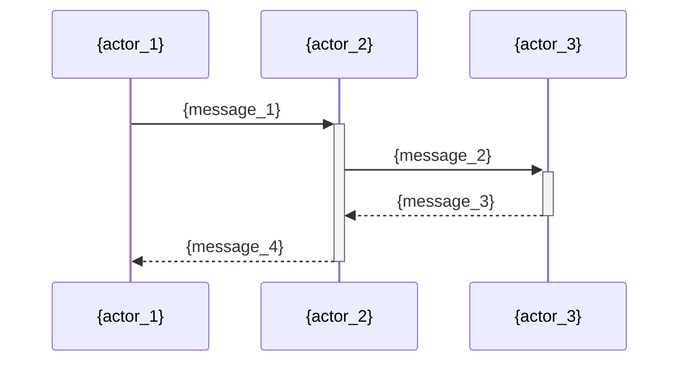

# Documentation Templates

Structural templates for each documentation type generated by `/build:docs`. The doc-writer agent fills in `{placeholder}` values based on codebase analysis.

---

## 1. README Template

````markdown
# {product_name}

{one_line_description}

<!-- build:docs:start:features -->
## Features

- {feature_1}
- {feature_2}
- {feature_3}
<!-- build:docs:end:features -->

<!-- build:docs:start:quickstart -->
## Quick Start

### Prerequisites

- {prerequisite_1}
- {prerequisite_2}

### Installation

```bash
{install_command_1}
{install_command_2}
```

### Running

```bash
{run_command}
```
<!-- build:docs:end:quickstart -->

<!-- build:docs:start:usage -->
## Usage

{usage_overview}

```bash
{usage_example}
```
<!-- build:docs:end:usage -->

<!-- build:docs:start:docs -->
## Documentation

- [{doc_title_1}]({doc_link_1})
- [{doc_title_2}]({doc_link_2})
- [{doc_title_3}]({doc_link_3})
<!-- build:docs:end:docs -->

<!-- build:docs:start:contributing -->
## Contributing

See [{contributing_link_text}]({contributing_link}) for guidelines.
<!-- build:docs:end:contributing -->

<!-- build:docs:start:license -->
## License

{license_type} - see [LICENSE](LICENSE) for details.
<!-- build:docs:end:license -->
````

---

## 2. User Guide Template

````markdown
<!-- auto-generated by build:docs — do not edit above this line -->
# {product_name} User Guide

{intro_paragraph}

## Getting Started

{getting_started_description}

1. {setup_step_1}
2. {setup_step_2}
3. {setup_step_3}

## {feature_1_name}

{feature_1_description}

### How to {feature_1_action}

1. {step_1}
2. {step_2}
3. {step_3}

<!-- screenshot: {feature_1_screenshot_path} -->

## {feature_2_name}

{feature_2_description}

### How to {feature_2_action}

1. {step_1}
2. {step_2}
3. {step_3}

<!-- screenshot: {feature_2_screenshot_path} -->

## Troubleshooting

| Problem | Solution |
|---------|----------|
| {problem_1} | {solution_1} |
| {problem_2} | {solution_2} |
| {problem_3} | {solution_3} |

## FAQ

**{question_1}**

{answer_1}

**{question_2}**

{answer_2}

**{question_3}**

{answer_3}
````

---

## 3. Configuration Reference Template

````markdown
<!-- auto-generated by build:docs — do not edit above this line -->
# Configuration Reference

{config_overview}

## Environment Variables

| Variable | Description | Default | Required |
|----------|-------------|---------|----------|
| `{env_var_1}` | {env_description_1} | `{env_default_1}` | {env_required_1} |
| `{env_var_2}` | {env_description_2} | `{env_default_2}` | {env_required_2} |
| `{env_var_3}` | {env_description_3} | `{env_default_3}` | {env_required_3} |

## Config File Options

Configuration file: `{config_file_path}`

| Option | Type | Description | Default |
|--------|------|-------------|---------|
| `{option_1}` | `{type_1}` | {option_description_1} | `{option_default_1}` |
| `{option_2}` | `{type_2}` | {option_description_2} | `{option_default_2}` |
| `{option_3}` | `{type_3}` | {option_description_3} | `{option_default_3}` |

## CLI Flags

| Flag | Description | Default |
|------|-------------|---------|
| `{flag_1}` | {flag_description_1} | `{flag_default_1}` |
| `{flag_2}` | {flag_description_2} | `{flag_default_2}` |
| `{flag_3}` | {flag_description_3} | `{flag_default_3}` |
````

---

## 4. API Reference Template

````markdown
<!-- auto-generated by build:docs — do not edit above this line -->
# API Reference

**Base URL:** `{base_url}`

**Authentication:** {auth_method}

## {endpoint_group_1}

### {method_1} `{path_1}`

{endpoint_1_description}

**Parameters**

| Name | In | Type | Required | Description |
|------|----|------|----------|-------------|
| `{param_1}` | {in_1} | `{type_1}` | {required_1} | {param_description_1} |
| `{param_2}` | {in_2} | `{type_2}` | {required_2} | {param_description_2} |

**Response**

```json
{response_example_1}
```

**Errors**

| Status | Code | Description |
|--------|------|-------------|
| `{status_1}` | `{error_code_1}` | {error_description_1} |
| `{status_2}` | `{error_code_2}` | {error_description_2} |

### {method_2} `{path_2}`

{endpoint_2_description}

**Parameters**

| Name | In | Type | Required | Description |
|------|----|------|----------|-------------|
| `{param_1}` | {in_1} | `{type_1}` | {required_1} | {param_description_1} |

**Response**

```json
{response_example_2}
```

**Errors**

| Status | Code | Description |
|--------|------|-------------|
| `{status_1}` | `{error_code_1}` | {error_description_1} |

## {endpoint_group_2}

### {method_3} `{path_3}`

{endpoint_3_description}

**Parameters**

| Name | In | Type | Required | Description |
|------|----|------|----------|-------------|
| `{param_1}` | {in_1} | `{type_1}` | {required_1} | {param_description_1} |

**Response**

```json
{response_example_3}
```

**Errors**

| Status | Code | Description |
|--------|------|-------------|
| `{status_1}` | `{error_code_1}` | {error_description_1} |
````

---

## 5. Architecture Overview Template

````markdown
<!-- auto-generated by build:docs — do not edit above this line -->
# Architecture Overview

{system_overview}

## Architecture Diagram

```mermaid
graph TB
    {component_1}[{component_1_label}] --> {component_2}[{component_2_label}]
    {component_2} --> {component_3}[{component_3_label}]
    {component_1} --> {component_4}[{component_4_label}]
    {component_3} --> {component_5}[{component_5_label}]
```

## Key Components

| Component | Responsibility | Key Files |
|-----------|---------------|-----------|
| {component_1_name} | {component_1_responsibility} | `{component_1_files}` |
| {component_2_name} | {component_2_responsibility} | `{component_2_files}` |
| {component_3_name} | {component_3_responsibility} | `{component_3_files}` |

## Data Flow

{data_flow_description}



## Technology Stack

| Layer | Technology | Purpose |
|-------|-----------|---------|
| {layer_1} | {technology_1} | {purpose_1} |
| {layer_2} | {technology_2} | {purpose_2} |
| {layer_3} | {technology_3} | {purpose_3} |

## Key Design Decisions

| Decision | Rationale |
|----------|-----------|
| {decision_1} | {rationale_1} |
| {decision_2} | {rationale_2} |
| {decision_3} | {rationale_3} |
````

---

## 6. Contributing Guide Template

````markdown
<!-- auto-generated by build:docs — do not edit above this line -->
# Contributing to {product_name}

## Prerequisites

- {prerequisite_1}
- {prerequisite_2}
- {prerequisite_3}

## Getting Started

```bash
{clone_command}
{install_deps_command}
{setup_command}
```

## Running Locally

```bash
{run_local_command}
```

## Testing

Run all tests:

```bash
{test_all_command}
```

Run a single test file:

```bash
{test_single_command}
```

Generate coverage report:

```bash
{test_coverage_command}
```

## Code Style

Lint:

```bash
{lint_command}
```

Format:

```bash
{format_command}
```

## Project Structure

```
{project_root}/
├── {dir_1}/          # {dir_1_description}
├── {dir_2}/          # {dir_2_description}
├── {dir_3}/          # {dir_3_description}
├── {file_1}          # {file_1_description}
└── {file_2}          # {file_2_description}
```

## Making Changes

1. Fork the repository
2. Create a feature branch: `git checkout -b {branch_naming_convention}`
3. Make your changes
4. Run tests: `{test_all_command}`
5. Run linter: `{lint_command}`
6. Commit with a descriptive message
7. Push and open a pull request
````
